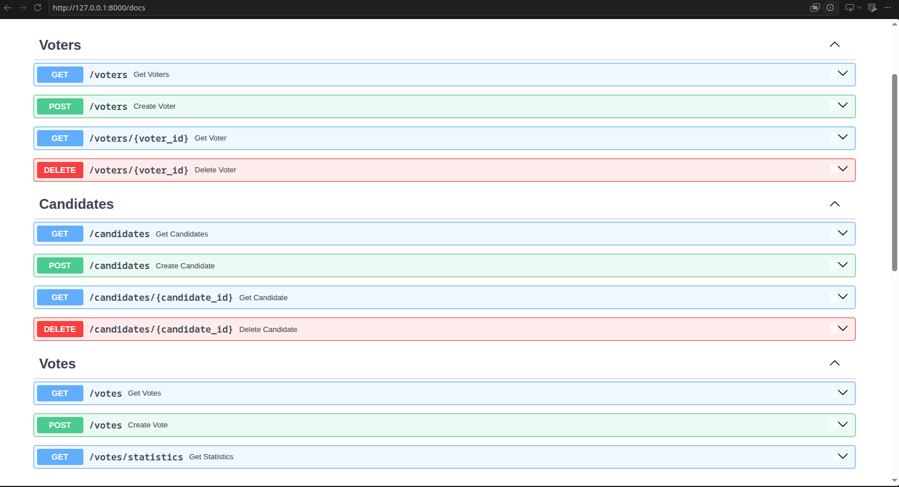
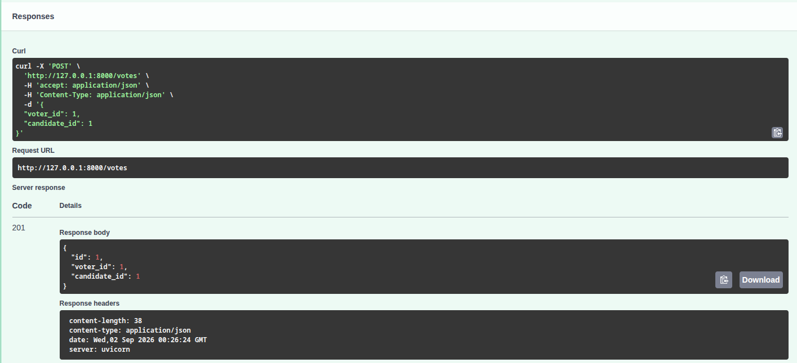
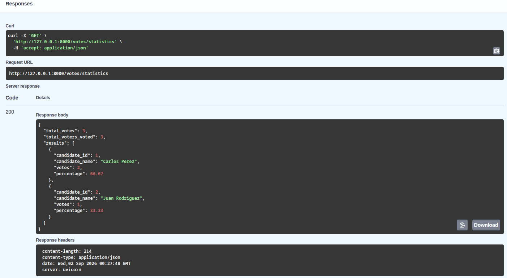

# Sistema de Votaciones

## Descripción

API RESTful desarrollada en Python para gestionar un sistema de votaciones. La aplicación permite registrar votantes y candidatos, registrar votos garantizando que cada votante pueda votar una sola vez y consultar estadísticas de los resultados.

## Tecnologías utilizadas

- Python 3
- FastAPI — desarrollo de la API RESTful
- SQLAlchemy — ORM y manejo de la base de datos
- Pydantic — validación y serialización de datos
- SQLite — base de datos utilizada para el proyecto
- Uvicorn — servidor ASGI
- Pytest — pruebas automatizadas

## Estructura del proyecto

```text
VotingAPI/
    app/
        main.py
        database.py
        models/
            voter.py
            candidate.py
            vote.py
        schemas/
            voter.py
            candidate.py
            vote.py
            statistics.py
        routers/
            voters.py
            candidates.py
            votes.py
        services/
            voting.py
    data/ (Aqui se almacena la DB SQLite )
    tests/
        conftest.py
        test_voters.py
        test_candidates.py
        test_votes.py
    .gitignore
    requirements.txt
    README.md
```

La aplicación está organizada por responsabilidades, separando modelos de base de datos, esquemas de validación, routers para los endpoints y lógica de negocio.

## Instalación y ejecución

1. Clonar el repositorio

`git clone <URL_DEL_REPOSITORIO>`
`cd VotingAPI`

2. Crear un entorno virtual

`python -m venv .venv`

3. Activar el entorno virtual

En Linux/macOS:

`source .venv/bin/activate`

En Windows:

`.venv\Scripts\activate`

4. Instalar las dependencias

`pip install -r requirements.txt`

5. Ejecutar la aplicación

`uvicorn app.main:app --reload`

La API estará disponible en:

`http://127.0.0.1:8000`

La documentación interactiva de Swagger UI está disponible en:

`http://127.0.0.1:8000/docs`

La base de datos SQLite se crea automáticamente en `data/voting.db` al iniciar la aplicación.

## Documentación de la API

Votantes

| Método | Endpoint | Descripción |
|---|---|---|
|POST|`/voters`|Registrar un votante |
|GET|`/voters`|Obtener todos los votantes |
|GET|`/voters/{id}`|Obtener un votante por ID |
|DELETE|`/voters/{id}`|Eliminar un votante |


Candidatos

| Método | Endpoint | Descripción |
|---|---|---|
|POST|`/candidates`|Registrar un candidato |
|GET|`/candidates`|Obtener todos los candidatos |
|GET|`/candidates/{id}`|Obtener un candidato por ID |
|DELETE|`/candidates/{id}`|Eliminar un candidato |


Votos

| Método | Endpoint | Descripción |
|---|---|---|
|POST|`/votes`|Registrar un voto |
|GET|`/votes`|Obtener los votos registrados |
|GET|`/votes/statistics`|Consultar estadísticas de votación |


#### Ejemplos de uso

La API puede ser probada directamente mediante Swagger UI en `/docs`.

A continuación se muestran capturas de la interfaz, la cual puede ser usada para realizar pruebas manuales:



Aca se puede ver por ejemplo, el registro de un voto dentro de esta interfaz



## Reglas de negocio y validaciones

La API implementa las siguientes reglas:

- El correo electrónico de cada votante debe ser único.
- Un votante no puede registrarse como candidato y un candidato no puede registrarse como votante.
- La validación de exclusión entre votantes y candidatos se realiza utilizando el nombre normalizado, ignorando mayúsculas/minúsculas y espacios al inicio o final.
- Un votante solo puede emitir un voto.

Al registrar un voto:

- Se crea el registro del voto.
- El atributo `has_voted` del votante se actualiza a `true`.
- El contador de votos del candidato se incrementa.
- No se puede eliminar un votante que ya haya votado.
- No se puede eliminar un candidato que haya recibido votos.
- Los identificadores de votantes y candidatos deben ser valores positivos.

Adicionalmente:

- Los nombres deben contener al menos un carácter no vacío.
- Los correos electrónicos son validados mediante `EmailStr`.
- Los porcentajes de votación se calculan sobre el total de votos registrados.

## Pruebas

El proyecto cuenta con pruebas automatizadas utilizando Pytest, cubriendo los endpoints y las principales reglas de negocio.

Para ejecutar las pruebas:

`python -m pytest`

Resultado actual:

35 passed

Las pruebas incluyen validaciones de:

- Registro y consulta de votantes.
- Registro y consulta de candidatos.
- Registro de votos.
- Votos duplicados.
- Votantes o candidatos inexistentes.
- Validación de nombres y correos.
- Exclusión entre votantes y candidatos.
- Actualización del estado has_voted.
- Incremento del contador de votos.
- Restricciones de eliminación.
- Cálculo de estadísticas.

## Estadísticas

El endpoint:

GET `/votes/statistics`

proporciona:

El total de votos registrados, el total de votantes que han emitido su voto,la cantidad de votos por candidato, y el porcentaje de votos obtenido por cada candidato.



## Autor

Santiago Andres Pacheco Garcia - 
santiagoapachecog@gmail.com